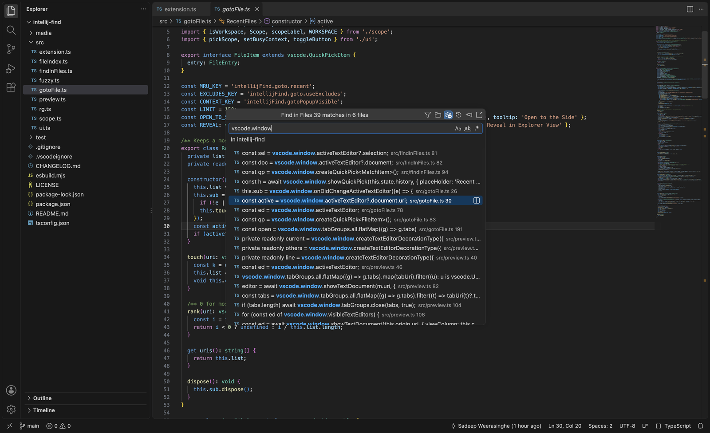
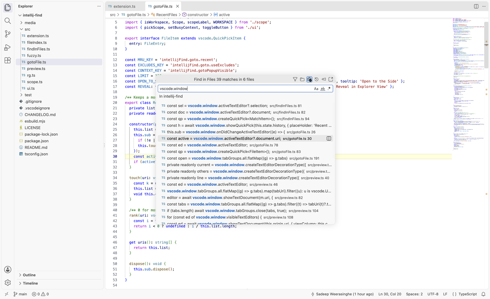
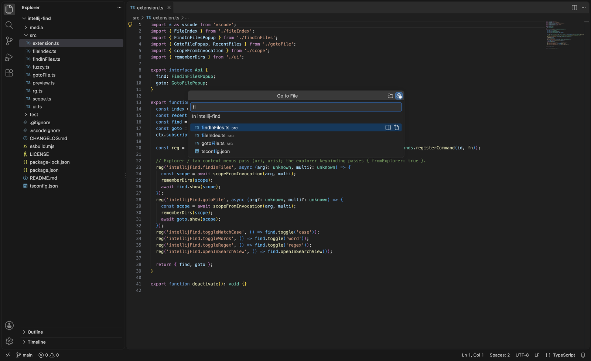
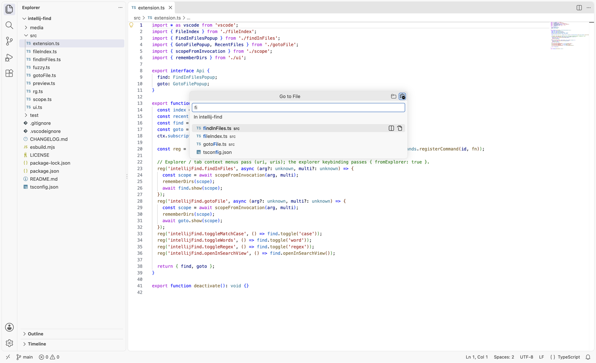

# IntelliJ Find

IntelliJ-style **Find in Files** (`⇧⌘F`), **Replace in Files** (`⇧⌘R`) and **Go to File** (`⇧⌘N`) for VS Code, as centered popups.

> These shortcuts replace VS Code's defaults (`⇧⌘F` Search view, `⇧⌘N` New Window; on Windows/Linux `Ctrl+Shift+R` is normally *Refactor…*). The Search view is still one click away via *Open in Search View* (`⌘↵`) in the popup; to keep a default, remove the binding in *Keyboard Shortcuts*.

## Find in Files — `⇧⌘F` / `Ctrl+Shift+F`

- Live results as you type (bundled ripgrep), one row per matching line: `line text   path/file.ts 42`, with file-type icons.
- **Match Case / Words / Regex** toggles inside the input (`⌥C` `⌥W` `⌥X`, also `⌥⌘C/W/R`).
- Title bar: **File mask** (`*.ts, !*.test.ts`), **Scope** (workspace / directory / recent dirs / browse), **Use excludes & ignore files**, **History**, **Pin**, **Open in Search View** (`⌘↵`).
- Moving through results previews the match in the editor behind the popup (highlighted). `Esc` restores the previous editor and closes the preview tab; `Enter` opens it; the split button on a row opens it to the side.
- Selected editor text pre-fills the query; otherwise the last query is restored (selected, so typing replaces it).




## Replace in Files — `⇧⌘R` / `Ctrl+Shift+R`

The Find in Files popup in replace mode (same search, toggles, mask and scope). `⇧⌘F` / `⇧⌘R` switch between the two.

- Type the search, then press `⇧⌘R` again (or the ⟳ button) to set the replacement. Selecting text first and pressing `⇧⌘R` jumps straight to the replacement.
- Each row previews the result (`→ replaced line`); the editor behind shows the old text struck through with the replacement inline.
- `⌥↵` (or the row's ⟳ button) replaces that line's occurrences; `⌥A` (or the Replace All button) replaces **every** match in scope after a confirmation with the count.
- Regex mode supports `$1`, `$<name>`, `$&` and `\n` in the replacement.
- Safe by default: each occurrence is re-checked against the current file text and skipped if it changed since the search. Files without unsaved changes are saved; files you're editing are left unsaved. The whole replacement is a single undo step.
- `⌘↵` hands the search and replacement to VS Code's Search view for a diff-style review.

## Go to File — `⇧⌘N` / `Ctrl+Shift+N`

- IntelliJ-style matching: substring anywhere, then camel-hump / word-start fragments (`fif` → `findInFiles.ts`, `extts` → `extension.ts`).
- `dir/name` narrows by directory components in order (`src/ext`), `dir/` lists a directory, `name:12:3` jumps to line and column.
- Empty query shows recent files. Directories are listed too (Enter reveals them in the Explorer).





## Scoping to a directory

- **Keyboard:** with the Explorer focused, `⇧⌘F` / `⇧⌘R` / `⇧⌘N` work on the selected folder (a selected file means its parent folder; multi-select works).
- **Right-click:** *Find in Files…*, *Replace in Files…* and *Go to File…* in the Explorer context menu and the editor tab context menu. *Find in Files…* and *Replace in Files…* also appear in the editor context menu when text is selected.
- The scope is shown under the input and can be changed from the folder button.


## Notes

- **Tip:** for IntelliJ-style placement in the middle of the window, drag the popup by its title bar; VS Code remembers the position (for all quick-pick popups). Double-click the title bar to snap it back to the top.

- Follows VS Code's `files.exclude`, `search.exclude`, `search.useIgnoreFiles`, `search.useParentIgnoreFiles`, `search.useGlobalIgnoreFiles` and `search.followSymlinks`. Toggle the *exclude* button to include ignored files (remembered per workspace).
- Explorer-selection scoping from the keyboard reads the selection via the built-in *Copy Path* command and restores the clipboard's text afterwards (non-text clipboard content is not preserved).
- Settings: `intellijFind.maxResults` (default 1000), `intellijFind.previewOnNavigate` (default true).

Not affiliated with or endorsed by JetBrains. IntelliJ is a trademark of JetBrains s.r.o.

## Development

```bash
npm install
npm test               # typecheck + unit + integration (runs the installed VS Code)
npm run install-local  # package and install into VS Code
npm run screenshots    # regenerate the README screenshots
```
